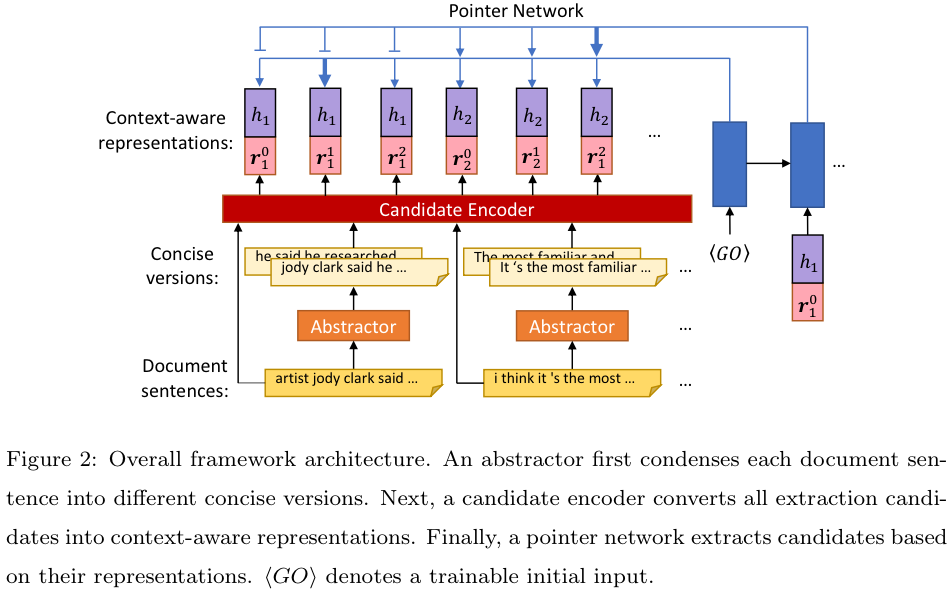

# A Condense-then-select Framework for Text Summarization

This repository contains the source code for our paper "[A Condense-then-select Framework for Text Summarization]()" in the KBS journal. 

Our source code is built on the code of [Fast Abstractive Summarization-RL](https://github.com/ChenRocks/fast_abs_rl). 

If you use our code, please cite our paper:
```
@article{condense_then_abstract_2021,
  title={A condense-then-select strategy for text summarization},
  author={Chan, Hou Pong and King, Irwin},
  journal={Knowledge-Based Systems},
  pages={107235},
  year={2021},
  publisher={Elsevier}
}
```

## Model Architecture


## Dependencies
- Python 3.6
- Pytorch 1.4.0
- cytoolz
- tensorboardX
- pyrouge
- sentence-transformers 0.3.3
- transformers 3.0.2

Please refer to the requirements.txt for the full dependencies.

## Data
- *CNN/DM*: you can download our preprocessed version of CNN/DM dataset [here](https://www.dropbox.com/s/uyylit2q9jptkm9/process-cnn-dailymail.tar.gz?dl=0)
for downloading and preprocessing the CNN/DailyMail dataset. 
- *DUC-2002*: please sign the agreements and request the DUC-2002 dataset follows the instructions [here](https://duc.nist.gov/data.html). After you obtain their approval, please send an email to me (hpchan@um.edu.mo) to request our preprocessed version of DUC-2002. 
- *Pubmed*: you can download our preprocessed version of Pubmed dataset [here](https://www.dropbox.com/s/3fyvh7wcwqhibe0/pubmed_dataset_json.tar.gz?dl=0). 

## Setup
## Our method with 1to1 top-1 abstractor
### Training on CNN/DM
- Export the path of CNN/DM dataset `export DATA=path/to/CNNDM`
- Export the path for storing the cache of pretrained models `export MODEL_CACHE=path/to/model_cache`
- make the pseudo-labels for abstractor
```
python make_extraction_labels.py --ROUGE_mode r
```
- pretrain the word2vec word embeddings
```
python train_word2vec.py --path=[path/to/word2vec]
```
- build vocab
```
python build_vocab_pubmed.py --data_dir path/to/CNNDM
```
- train one-to-one abstractor using ML objective
```
python train_abstractor.py --path=[path/to/abstractor] --w2v=[path/to/word2vec/word2vec.128d.226k.bin]
```
- generate candidates from one-to-one abstractor. Alternatively, you can download our generated candidates [here](https://www.dropbox.com/s/4az6vqniruch512/cnn_dm_one2one_top1_cands.tar.gz?dl=0), and move the extracted folders to `path/to/data/`. 
```
python decode_candidates.py --path=[path/to/data/train_cand_top1_beam] --abs_dir=saved_models/abstractor --beam=5 --topk 1 --batch 16 --split train
python decode_candidates.py --path=[path/to/data/val_cand_top1_beam] --abs_dir=saved_models/abstractor --beam=5 --topk 1 --batch 12 --split val
```
- make the pseudo-labels for extractor
```
python make_extraction_labels.py --folder_name train_cand_top1_beam --ROUGE_mode f
python make_extraction_labels.py --folder_name val_cand_top1_beam --ROUGE_mode f
```
- train extractor using ML objective with Sentence-BERT
```
python train_extractor_ml.py --path=saved_models/extractor_ml_top1_beam --net-type rewritten_sent_word_bert_rnn --num_candidates 2 --train_set_folder train_cand_top1_beam --valid_set_folder val_cand_top1_beam --batch 64 --min_lr 1e-5 --lr 5e-4 --ckpt_freq 1500
```
- train extractor using RL objective with Sentence-BERT
```
python train_full_rl.py --path=saved_models/extractor_rl_top1_beam --ext_dir=saved_models/extractor_ml_top1_beam --abs_dir=saved_models/abstractor --num_candidates 2 --ext_type rewritten_sent_word_bert_rnn --train_set_folder train_cand_top1_beam --valid_set_folder val_cand_top1_beam --min_lr 1e-5 --patience 9 --reward_type 2 --lr 5e-5
```
- (Optional) train extractor using ML objective without Sentence-BERT
```
python train_extractor_ml.py --path=saved_models/extractor_ml_top1_beam_no_BERT --w2v=pretrained_embedding/word2vec.128d.226k.bin --net-type rewritten_rnn --num_candidates 2 --train_set_folder train_cand_top1_beam --valid_set_folder val_cand_top1_beam
```
- (Optional) train extractor using RL objective without Sentence-BERT
```
python train_full_rl.py --path=saved_models/extractor_rl_top1_beam_no_BERT --ext_dir=saved_models/extractor_ml_top1_beam_no_BERT --abs_dir=saved_models/abstractor --num_candidates 2 --ext_type rewritten_rnn --train_set_folder train_cand_top1_beam --valid_set_folder val_cand_top1_beam --min_lr 5e-5 --patience 6 --reward_type 2
```
### Testing on CNN/DM
- Export the path of CNN/DM dataset `export DATA=path/to/CNNDM`
- Download pyrouge, and save it to `path/to/pyrouge`. 
```
git clone https://github.com/andersjo/pyrouge.git
```
- Export ROUGE score environment variable
```
export ROUGE=path/to/pyrouge/tools/ROUGE-1.5.5
```
- generate candidates from abstractor for the test set. You can skip this step if you downloaded our generated candidates. 
```
python decode_candidates.py --path=[path/to/data/test_cand_top1_beam] --abs_dir=saved_models/abstractor --beam=5 --topk 1 --batch 12 --split test
```
- Make the reference for evaluation
```
python make_eval_references.py --folder_name test_cand_top1_beam
```
- Decode summaries from model
```
python decode_full_model_cand.py --path [path/to/save/decoded/files] --model_dir [path/to/extractor_rl] --num_candidates 2 --beam 5 --test_set_folder test_cand_top1_beam --abstracted
```
- Run evaluation
```
python eval_full_model.py --rouge --decode_dir [path/to/save/decoded/files]
```
## Test on DUC
- Export the path of ROUGE
- Export the path of duc2002 dataset `export DATA=path/to/duc2002`
- generate candidates from compression-controllable abstractor. 
```
python decode_candidates.py --path=[path/to/data/test_cand_top1_beam] --abs_dir=saved_models/abstractor --beam=5 --topk 1 --batch 6 --split test
```
- Make the reference for evaluation
```
python make_eval_references_duc.py --folder_name test_cand_top1_beam
```
- Decode summaries from model
```
python3 -u decode_full_model_cand.py --path [path/to/save/decoded/files] --model_dir [path/to/extractor_rl] --num_candidates 2 --beam 5 --test_set_folder test_cand_top1_beam --abstracted
```
- Run evaluation
```
python eval_full_model_duc.py --rouge --decode_dir=[path/to/save/decoded/files]
```
### Train and test on Pubmed
- Export the path of ROUGE
- Export the path of Pubmed dataset `export DATA=path/to/pubmed`
- Export the path for storing the cache of pretrained models `export MODEL_CACHE=path/to/model_cache`
- make the pseudo-labels for abstractor
```
python make_extraction_labels.py --ROUGE_mode r
```
- build vocab
```
python build_vocab_pubmed.py --data_dir path/to/pubmed
```
- pretrain word embedding
```
python train_word2vec.py --path=[path/to/word2vec_pubmed]
```
- train one-to-one abstractor using ML objective 
```
python train_abstractor.py --path=saved_models/abstractor_ml_pubmed_max_50 --w2v=pretrained_embedding_pubmed/word2vec.128d.405k.bin --max_abs 50
```
- generate candidates from compression-controllable abstractor, or you can download our generated candidates [here](https://www.dropbox.com/s/s2giid5hrbdu4zb/cand_top1_beam_pubmed.tar.gz?dl=0), and move the extracted folders to `path/to/data/`. 
```
python decode_candidates.py --path=[path/to/data/train_cand_top1_beam] --abs_dir=saved_models/abstractor_ml_pubmed_max_50 --beam=5 --topk 1 --batch 12 --split train
python decode_candidates.py --path=[path/to/data/val_cand_top1_beam] --abs_dir=saved_models/abstractor_ml_pubmed_max_50 --beam=5 --topk 1 --batch 12 --split val
python decode_candidates.py --path=[path/to/data/test_cand_top1_beam] --abs_dir=saved_models/abstractor_ml_pubmed_max_50 --beam=5 --topk 1 --batch 12 --split test
```
- make the pseudo-labels for extractor
```
python make_extraction_labels.py --folder_name train_cand_top1_beam --ROUGE_mode f
python make_extraction_labels.py --folder_name val_cand_top1_beam --ROUGE_mode f
```
- train extractor using ML objective without Sentence-BERT
```
python3 -u train_extractor_ml.py --path=saved_models/extractor_ml_pubmed --net-type rewritten_rnn --num_candidates 2 --train_set_folder train_cand_top1_beam --valid_set_folder val_cand_top1_beam --batch 64 --min_lr 1e-5 --lr 5e-4 --ckpt_freq 1500 --max_word 100 --max_sent 700 --w2v=pretrained_embedding_pubmed/word2vec.128d.405k.bin
```
- train extractor using RL objective without Sentence-BERT
```
python3 -u train_full_rl.py --path=saved_models/extractor_rl_pubmed --ext_dir=saved_models/extractor_ml_pubmed --abs_dir=saved_models/abstractor_ml_pubmed_max_50 --num_candidates 2 --ext_type rewritten_rnn --train_set_folder train_cand_top1_beam --valid_set_folder val_cand_top1_beam --min_lr 1e-5 --patience 6 --reward_type 2 --max_word 100 --max_sent 700
```
- Decode summaries from model
```
python3 decode_full_model_cand.py --path=[path/to/save/decoded/files] --model_dir=[path/to/extractor_rl] --num_candidates 2 --beam 1 --test_set_folder test_cand_top1_beam --abstracted
```
- Make the reference for evaluation
```
python make_eval_references.py --folder_name test_cand_top1_beam
```
- Run evaluation
```
python3 eval_full_model_pubmed.py --rouge --decode_dir=[path/to/save/decoded/files]
```

## Our method with compression-controllable abstractor
### Training on CNN/DM
- Export the path of CNN/DM dataset `export DATA=path/to/CNNDM`
- Export the path for storing the cache of pretrained models `export MODEL_CACHE=path/to/model_cache`
- make the pseudo-labels for abstractor, pretrain word embedding, and build vocab following the instructions in one2one abstractor, you only need to do it once. 
- make compression level labels for compression-controllable abstractor
```
python make_compression_label.py --split all
```
- train compression-controllable abstractor using ML objective
```
python train_controllable_abstractor.py --path=[path/to/compression_controllable_abstractor] --w2v=[path/to/word2vec/word2vec.128d.226k.bin]
```
- generate candidates from compression-controllable abstractor. Alternatively, you can download our generated candidates [here](https://www.dropbox.com/s/mmwvccih16pnbgv/cnn_dm_compress_ctrl_cands.tar.gz?dl=0) and move the extracted folders to `path/to/data/`. 
```
python decode_compression.py --path=[path/to/data/val_cand_control_abs_2] --abs_dir=[path/to/compression_controllable_abstractor] --beam=5 --topk 1 --batch 3 --split val --n_compression_levels 2
python decode_compression.py --path=[path/to/data/train_cand_control_abs_2] --abs_dir=[path/to/compression_controllable_abstractor] --beam=5 --topk 1 --batch 3 --split train --n_compression_levels 2
```
- make the pseudo-labels for extractor
```
python make_extraction_labels.py --folder_name train_cand_control_abs_2 --ROUGE_mode f
python make_extraction_labels.py --folder_name val_cand_control_abs_2 --ROUGE_mode f
```
- train extractor using ML objective with Sentence-BERT
```
python train_extractor_ml.py --path=[path/to/extractor_ml] --net-type rewritten_sent_word_bert_rnn --num_candidates 3 --train_set_folder train_cand_control_abs_2 --valid_set_folder val_cand_control_abs_2 --batch 64 --min_lr 1e-5 --lr 5e-4 --ckpt_freq 1500
```
- train extractor using RL objective with Sentence-BERT
```
python train_full_rl.py --path=[path/to/extractor_rl] --ext_dir=[path/to/extractor_ml] --abs_dir=[path/to/compression_controllable_abstractor] --num_candidates 3 --ext_type rewritten_sent_word_bert_rnn --train_set_folder train_cand_control_abs_2 --valid_set_folder val_cand_control_abs_2 --min_lr 1e-5 --patience 9 --reward_type 2
```
- (Optional) train extractor using ML objective without Sentence-BERT
```
python train_extractor_ml.py --path=[path/to/extractor_ml_no_BERT] --net-type rewritten_rnn --w2v=pretrained_embedding/word2vec.128d.226k.bin --num_candidates 3 --train_set_folder train_cand_control_abs_2 --valid_set_folder val_cand_control_abs_2
```
- (Optional) train extractor using RL objective without Sentence-BERT
```
python train_full_rl.py --path=[path/to/extractor_rl_no_BERT] --ext_dir=[path/to/extractor_ml_no_BERT] --abs_dir=[path/to/compression_controllable_abstractor] --num_candidates 3 --ext_type rewritten_sent_word_bert_rnn --train_set_folder train_cand_control_abs_2 --valid_set_folder val_cand_control_abs_2 --min_lr 5e-5 --patience 6 --reward_type 2
```
### Testing on CNN/DM
- Export the path of CNN/DM dataset `export DATA=path/to/CNNDM`
- Download and export the path of ROUGE following the testing procedure of 1to1 top-1 abstractor.
- generate candidates from compression-controllable abstractor. You can skip this step by downloading our 
```
python decode_compression.py --path=[path/to/data/test_cand_control_abs_2] --abs_dir=[path/to/compression_controllable_abstractor] --beam=5 --topk 1 --batch 3 --split test --n_compression_levels 2
```
- Make the reference for evaluation
```
python make_eval_references.py --folder_name test_cand_control_abs_2
```

- Decode summaries from model
```
python decode_full_model_cand.py --path [path/to/save/decoded/files] --model_dir [path/to/extractor_rl] --num_candidates 3 --beam 5 --test_set_folder test_cand_control_abs_2 --abstracted
```
- Run evaluation
```
python eval_full_model.py --rouge --decode_dir [path/to/save/decoded/files]
```
## Test on DUC
- Export the path of ROUGE
- Export the path of duc2002 dataset `export DATA=path/to/duc2002`
- generate candidates from compression-controllable abstractor. 
```
python decode_compression.py --path=[path/to/data/test_cand_control_abs_2] --abs_dir=[path/to/compression_controllable_abstractor] --beam=5 --topk 1 --batch 3 --split test --n_compression_levels 2
```
- Make the reference for evaluation
```
python make_eval_references_duc.py --folder_name test_cand_control_abs_2
```
- Decode summaries from model
```
python3 -u decode_full_model_cand.py --path [path/to/save/decoded/files] --model_dir [path/to/extractor_rl] --num_candidates 3 --beam 5 --test_set_folder test_cand_control_abs_2 --abstracted
```
- Run evaluation
```
python eval_full_model_duc.py --rouge --decode_dir=[path/to/save/decoded/files]
```
### Train and test on Pubmed
- Export the path of ROUGE
- Export the path of Pubmed dataset `export DATA=path/to/pubmed`
- Export the path for storing the cache of pretrained models `export MODEL_CACHE=path/to/model_cache`
- make the pseudo-labels for abstractor, pretrain word embedding, and build vocab following the instructions in one2one abstractor, you only need to do it once. 
- make compression level labels for compression-controllable abstractor
```
python make_compression_label.py --split all
```
- train compression-controllable abstractor using ML objective 
```
python train_controllable_abstractor.py --path=saved_models/control_abstractor_pubmed_max_50 --w2v=pretrained_embedding_pubmed/word2vec.128d.405k.bin --max_abs 50
```
- generate candidates from compression-controllable abstractor, or you can download our generated candidates [here](https://www.dropbox.com/s/ezyr7e822syxsbc/cand_control_abs_2_pubmed.tar.gz?dl=0), and move the extracted folders to `path/to/data/`.
```
python decode_compression.py --path=[path/to/data/train_cand_control_abs_2] --abs_dir=saved_models/control_abstractor_pubmed_max_50 --beam=5 --topk 1 --batch 4 --split train --n_compression_levels 2 --max_dec_word 50
python decode_compression.py --path=[path/to/data/val_cand_control_abs_2] --abs_dir=saved_models/control_abstractor_pubmed_max_50 --beam=5 --topk 1 --batch 4 --split val --n_compression_levels 2 --max_dec_word 50
python decode_compression.py --path=[path/to/data/test_cand_control_abs_2] --abs_dir=saved_models/control_abstractor_pubmed_max_50 --beam=5 --topk 1 --batch 4 --split test --n_compression_levels 2 --max_dec_word 50
```
- make the pseudo-labels for extractor
```
python make_extraction_labels.py --folder_name train_cand_control_abs_2 --ROUGE_mode f
python make_extraction_labels.py --folder_name val_cand_control_abs_2 --ROUGE_mode f
```
- train extractor using ML objective without Sentence-BERT
```
python3 -u train_extractor_ml.py --path=[path/to/extractor_ml_pubmed] --net-type rewritten_rnn --num_candidates 3 --train_set_folder train_cand_control_abs_2 --valid_set_folder val_cand_control_abs_2 --batch 32 --min_lr 1e-5 --lr 5e-4 --ckpt_freq 3000 --max_word 100 --max_sent 1050 --w2v=pretrained_embedding_pubmed/word2vec.128d.405k.bin
```
- train extractor using RL objective without Sentence-BERT
```
python3 -u train_full_rl.py --path=[path/to/extractor_rl_pubmed] --ext_dir=[path/to/extractor_ml_pubmed] --abs_dir=saved_models/abstractor_ml_pubmed_max_50 --num_candidates 3 --ext_type rewritten_rnn --train_set_folder train_cand_control_abs_2 --valid_set_folder val_cand_control_abs_2 --min_lr 1e-5 --patience 6 --reward_type 2 --max_word 100 --max_sent 1050
```
- Decode summaries from model
```
python3 decode_full_model.py --path=[path/to/save/decoded/files] --model_dir=[path/to/extractor_rl_pubmed] --beam=5 --test
```
- Make the reference for evaluation
```
python make_eval_references.py --folder_name test_cand_control_abs_2
```
- Run evaluation
```
python3 eval_full_model_pubmed.py --rouge --decode_dir=[path/to/save/decoded/files]
```
